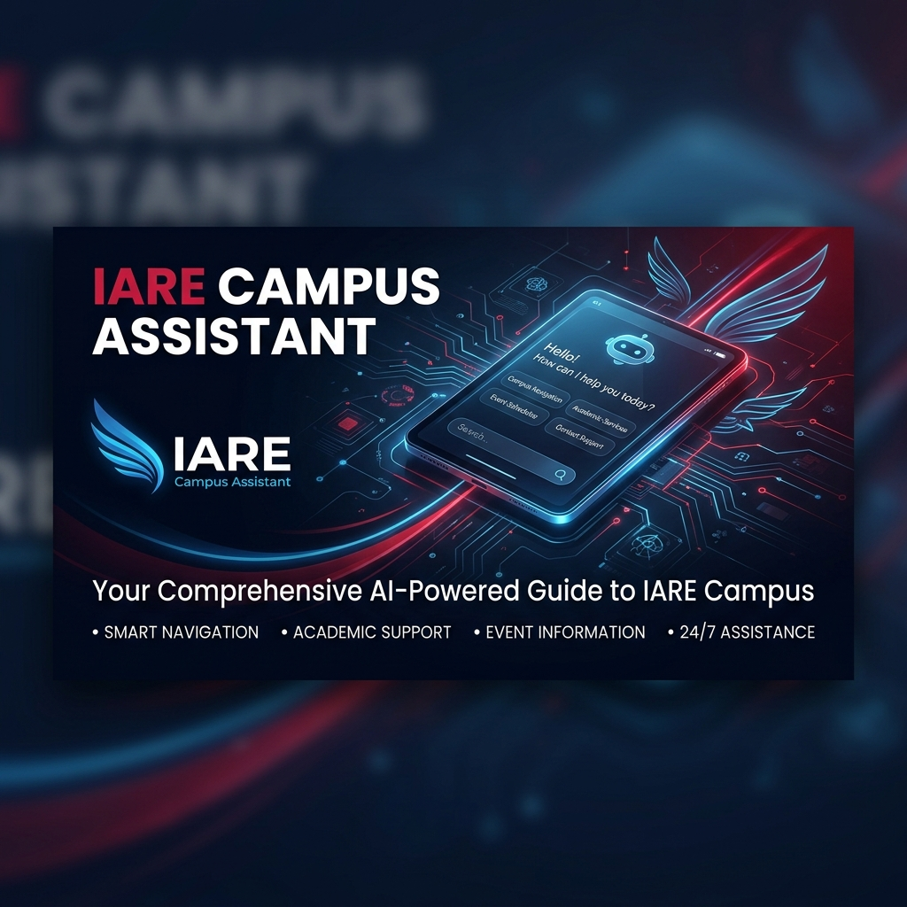

<!-- Banner Header -->
<div align="center">
  

  # ✈️ IARE Campus Assistant
  ### *The Official AI-Powered Chatbot for the Institute of Aeronautical Engineering (IARE), Hyderabad*

  <br/>

  [](https://nodejs.org/)
  [](https://www.typescriptlang.org/)
  [](https://expressjs.com/)
  [](https://aistudio.google.com/)
  [](https://opensource.org/licenses/ISC)

  <br/>

  > **Instant responses. Dynamic fallback. Tailored specifically for IARE.**  
  > Powered by **Google Gemini 2.0 Flash** with a robust, offline-capable local knowledge base fallback.  
  > Designed to answer admissions, academic programs, placements, research, campus infrastructure, and campus life queries.

  ---
</div>

<br/>

## 📑 Table of Contents

- [✨ Project Overview](#-project-overview)
- [🚀 Core Features](#-core-features)
- [🏗️ System Architecture](#-system-architecture)
- [📂 Project Structure](#-project-structure)
- [🛠️ Technical Stack](#-technical-stack)
- [📋 Prerequisites](#-prerequisites)
- [⚡ Quick Start](#-quick-start)
- [🔑 Environment Variables](#-environment-variables)
- [🎛️ Operation Modes](#-operation-modes)
  - [🤖 Gemini AI Mode](#-gemini-ai-mode)
  - [📚 Local Knowledge Base Mode](#-local-knowledge-base-mode)
- [🌐 API Reference](#-api-reference)
- [📚 Knowledge Base Directory](#-knowledge-base-directory)
- [🔌 Embeddable Chat Widget](#-embeddable-chat-widget)
- [🎨 Front-end & UI Theme](#-front-end--ui-theme)
- [📦 Available Scripts](#-available-scripts)
- [☁️ Deployment Options](#-deployment-options)
- [🔒 Security Best Practices](#-security-best-practices)
- [🧩 Extending the Knowledge Base](#-extending-the-knowledge-base)
- [🐛 Troubleshooting & FAQ](#-troubleshooting--faq)
- [📞 IARE Contact Information](#-iare-contact-information)

---

## ✨ Project Overview

The **IARE Campus Assistant** is a full-stack, production-ready AI chatbot designed and built specifically for the [Institute of Aeronautical Engineering (IARE)](https://www.iare.ac.in/), Hyderabad. It acts as a **24/7 digital concierge** serving:

*   🎓 **Prospective Students:** Getting details about courses, admissions, fees, and ranks.
*   👨‍🎓 **Current Students:** Finding exam links, portals, transport, and calendars.
*   👪 **Parents:** Inspecting placement statistics, hostel guidelines, and contact numbers.
*   👩‍🏫 **Faculty & Candidates:** Exploring research environments and career listings.
*   🏛️ **Alumni:** Seeking degree verification steps and community portals.

> [!NOTE]
> The chatbot runs in two seamlessly integrated modes: **Google Gemini AI Mode** (delivering natural conversation and context retention) and a **Local Knowledge Base Mode** (using an offline, sub-millisecond keyword-matching search engine for zero-cost operation).

---

## 🚀 Core Features

<table>
  <tr>
    <td width="50%" valign="top">
      <h3>🤖 Intelligent Conversational Flow</h3>
      <ul>
        <li><b>Multi-Model Cascade:</b> Automatically cascades across models (<code>gemini-2.0-flash</code> ➔ <code>gemini-2.0-flash-lite</code> ➔ <code>gemini-1.5-flash</code>) to bypass temporary rate limits.</li>
        <li><b>Graceful Fallback:</b> Automatically falls back to the local Knowledge Base if all API options are rate-limited, keeping the user interface completely functional.</li>
        <li><b>Context Awareness:</b> Maintains conversational context by keeping track of the last 12 history turns.</li>
        <li><b>IARE Guardrails:</b> Employs strict system prompts to block off-topic queries and prevent hallucinations of critical figures (fees, cut-offs, dates).</li>
      </ul>
    </td>
    <td width="50%" valign="top">
      <h3>🎨 Premium Design & UI</h3>
      <ul>
        <li><b>Glassmorphism Theme:</b> A premium dark-mode dashboard built around official IARE branding colors (Deep Navy and Crimson).</li>
        <li><b>Frictionless UX:</b> Incorporates responsive chat elements, input-focus suggestions, and automatic links.</li>
        <li><b>Collapsible FAQ Chips:</b> Instantly displays 30+ interactive categories in Local Mode, allowing users to browse without typing.</li>
        <li><b>Markdown Support:</b> Dynamically renders structured headings, lists, bold text, and clickable external links in replies.</li>
      </ul>
    </td>
  </tr>
  <tr>
    <td width="50%" valign="top">
      <h3>🔌 Plug-and-Play Integration</h3>
      <ul>
        <li><b>One-Line Embedding:</b> Include the chatbot on any web page by embedding a single <code>&lt;script&gt;</code> tag.</li>
        <li><b>Automated Script Detection:</b> The widget automatically extracts its hosting environment's domain path to route backend requests.</li>
        <li><b>postMessage Security:</b> Employs secure, cross-frame message passing to update client page containers safely.</li>
        <li><b>Floating Launcher:</b> Integrates a floating action bubble and suggestion cards on host websites.</li>
      </ul>
    </td>
    <td width="50%" valign="top">
      <h3>⚡ Performance & Dev Experience</h3>
      <ul>
        <li><b>Sub-millisecond Search:</b> Features a local query parsing engine with custom phrase-matching weights (+5 for exact phrases, +1 for key terms).</li>
        <li><b>TypeScript Native:</b> Complete type safety across route logic, AI configuration, and the local dataset.</li>
        <li><b>Hot Reloading:</b> Utilizes <code>ts-node-dev</code> to live-compile changes as files are edited.</li>
        <li><b>Robust Error Boundaries:</b> Cathches API failures, network dropouts, and configuration anomalies gracefully.</li>
      </ul>
    </td>
  </tr>
</table>

---

## 🏗️ System Architecture

The client interacts with the server via direct fetch calls or via a cross-domain iframe managed by the client-side embeddable widget. Below is the end-to-end data flow structure:


## 🛠️ Technical Stack

| Category | Technology | Version | Purpose |
| :--- | :--- | :--- | :--- |
| **Runtime** | Node.js | `v18+` | Core asynchronous JavaScript/TypeScript execution environment |
| **Language** | TypeScript | `^5.9` | Static type safety and clean development abstractions |
| **Framework** | Express | `^5.2` | Clean routing, API handling, and static web page delivery |
| **AI Client** | `@google/generative-ai` | `^0.24` | Official SDK wrapper to query Gemini LLM endpoints |
| **Environment** | `dotenv` | `^17` | Loads environment keys from `.env` on app bootstrap |
| **Security** | `cors` | `^2.8` | Domain origin configuration control for API calls |
| **Dev Tools** | `ts-node-dev` | `^2.0` | Hot-reloading and development TypeScript-to-JS compilation |
| **Front-end** | Vanilla HTML5 / CSS3 / ES6 | — | Ultra-fast client load-times with no bulky runtime libraries |

---

## 📋 Prerequisites

Before running this application, confirm you have the following installed on your machine:

1.  **Node.js:** Check using `node --version` (Node 18 or above recommended).
2.  **npm:** Check using `npm --version` (npm 9 or above recommended).
3.  **Google AI Studio Key:** (Optional for local-only testing) Retrieve a free API Key from [Google AI Studio](https://aistudio.google.com/app/apikey).

---

## ⚡ Quick Start

Follow these steps to launch the application locally:

### 1. Clone the Repository
```bash
git clone <repository-url>
cd ai-chatbot
```

### 2. Install Dependencies
```bash
npm install
```

### 3. Setup the Environment File
Create a `.env` file in the root directory:
```env
# Google Gemini API Access (Obtain from https://aistudio.google.com/app/apikey)
GEMINI_API_KEY=your_actual_gemini_api_key_here

# Toggle Local Mode (true = Offline-only KB chips, false = AI Assistant with fallback)
USE_LOCAL_KB=false

# Controller setting (gemini = uses model, local = forces local KB lookup directly)
AI_PROVIDER=gemini
```

### 4. Run the Server
```bash
npm run dev
```

The output should confirm the loaded configurations:
```text
[IARE Bot] 🤖 Mode: AI (provider=GEMINI)
🚀 College AI Chatbot running on http://localhost:5000
```

### 5. Access the Interface
Open your web browser and navigate to the target address:
*   **Chat Application Interface:** [http://localhost:5000/](http://localhost:5000/)
*   **Widget Demonstration Showcase:** [http://localhost:5000/demo.html](http://localhost:5000/demo.html)

---

## 🔑 Environment Variables

| Parameter Name | Required? | Default Value | Description |
| :--- | :--- | :--- | :--- |
| `GEMINI_API_KEY` | Only in AI Mode | `""` | The authorization token for the Gemini API. |
| `USE_LOCAL_KB` | No | `false` | Set to `true` to completely disable AI network calls and run purely off the local database. |
| `AI_PROVIDER` | No | `gemini` | Configures the primary model provider (`gemini` or `local`). |

> [!IMPORTANT]
> If you make changes to your `.env` settings, you must manually restart your development process (Ctrl + C in terminal and re-run `npm run dev`) for the values to update.

---

## 🎛️ Operation Modes

### 🤖 Gemini AI Mode (`USE_LOCAL_KB=false`)
This is the default operating configuration. The server processes client requests via the Google Gemini 2.0 Flash engine.

*   **Prompt Grounding:** Uses a customized system prompt declaring IARE facts, contact listings, research figures, and rules to refuse off-topic inquiries.
*   **Conversation Length:** Bundles the user's message with up to the **last 12 conversation messages** in a rolling history buffer.
*   **Model Cascading Failover:** If the primary engine returns a `429 Rate Limit` (typical for free-tier limits of 30 RPM / 1,500 requests a day), the server auto-shifts to secondary engines after a 1-second delay:
    1.  `gemini-2.0-flash` (Primary)
    2.  `gemini-2.0-flash-lite` (Fallback 1)
    3.  `gemini-1.5-flash` (Fallback 2)
    4.  Local Knowledge Base Search (Last Resort Fallback)

---

### 📚 Local Knowledge Base Mode (`USE_LOCAL_KB=true`)
Designed for offline capability, high-traffic scenarios, or zero-cost hosting.

*   **Pre-defined Interactive Chips:** On configuration fetch (`/config`), the client receives an index of 30+ core topics (About IARE, CSE, Placements, etc.) and lists them as clickable tags.
*   **Weighted Phrase Match Algorithm:** When a query is manually entered, it is compared against the `KBEntry` definitions:
    *   **Exact Phrases Match:** Custom phrases earn **+5 points** (e.g., matching `"placement record"`).
    *   **Keyword Match:** Individual keywords earn **+1 point** (e.g., matching `"placement"`).
    *   The topic with the highest score is matched. If no score threshold is met, a default help contact message is shown.

---

## 🌐 API Reference

### 1. Fetch System Settings
Returns the active execution mode and the index of loaded topics (only when in local mode).

*   **URL:** `/config`
*   **Method:** `GET`
*   **Headers:** `Content-Type: application/json`

<details>
<summary><b>🔍 View Config Response Examples</b></summary>

**Example AI Mode Response:**
```json
{
  "mode": "gemini",
  "topics": []
}
```

**Example Local Mode Response:**
```json
{
  "mode": "local",
  "topics": [
    { "id": 0, "topic": "✈️ About IARE" },
    { "id": 1, "topic": "💻 Computer Science & Engineering" },
    { "id": 2, "topic": "💼 Placements" }
  ]
}
```
</details>

---

### 2. Fetch Topic Content
Retrieve the pre-compiled answer structure matching a specific ID in the Knowledge Base array.

*   **URL:** `/topic/:id`
*   **Method:** `GET`
*   **URL Params:** `id=[integer]`

<details>
<summary><b>🔍 View Topic Response Examples</b></summary>

**Success Response (200 OK):**
```json
{
  "topic": "💼 Placements",
  "answer": "💼 **Placements at IARE**\n\n• 🏆 **91%** of eligible students placed...\n• 🏢 Top recruiters: Microsoft, Amazon, JPMorgan...",
  "source": "local"
}
```

**Failure Response (404 Not Found):**
```json
{
  "error": "Topic not found"
}
```
</details>

---

### 3. Send Chat Query
Submits a user message along with conversation context to get a reply.

*   **URL:** `/chat`
*   **Method:** `POST`
*   **Headers:** `Content-Type: application/json`
*   **Request Body JSON:**
    ```json
    {
      "message": "What is the fee structure?",
      "history": [
        { "role": "user", "content": "Hello!" },
        { "role": "assistant", "content": "Hello! I am the IARE Campus Assistant..." }
      ]
    }
    ```

<details>
<summary><b>🔍 View Chat Response Examples</b></summary>

**Success Response (200 OK):**
```json
{
  "reply": "For tuition details and scholarship applications, please consult the official portal...",
  "source": "gemini"
}
```

**Missing Message Error (400 Bad Request):**
```json
{
  "error": "Message is required."
}
```
</details>

---

## 📚 Knowledge Base Directory

The offline repository `src/data/iareKnowledge.ts` consists of **36 distinct, pre-authorized topics** covering details about campus activities, departments, and support:

<details>
<summary><b>📁 Show All 36 Knowledge Base Topics</b></summary>

| ID | Title / Topic | Primary Search Phrases |
| :--- | :--- | :--- |
| **0** | ✈️ About IARE | about iare, what is iare, history of iare |
| **1** | 💻 Computer Science & Engineering | cse department, btech cse, ai ml, data science |
| **2** | ✈️ Aeronautical Engineering | aeronautical engineering, uav, wind tunnel |
| **3** | 📡 Electronics & Communication Engg. | ece department, vlsi, embedded systems |
| **4** | ⚡ Electrical & Electronics Engg. | eee department, power systems, drives |
| **5** | ⚙️ Mechanical Engineering | mechanical engineering, manufacturing |
| **6** | 🏗️ Civil Engineering | civil engineering, structural engineering |
| **7** | 🎓 MBA Program | mba program, business administration, icet |
| **8** | 🎓 M.Tech Programs | m.tech, gate admission, pgcet |
| **9** | 🔬 Ph.D Program | phd, doctoral, research degree |
| **10** | 📝 Admissions | how to apply, admission process, eamcet rank |
| **11** | 💼 Placements | placement record, campus recruitment, top companies |
| **12** | 🏭 Internships | summer internship, industrial training, isro |
| **13** | 📚 Library | central library, digital library, ilms |
| **14** | 🏫 Campus Facilities | smart classroom, wifi on campus, infrastructure |
| **15** | 🚌 Bus and Transport | college bus, bus routes, track bus, live gps |
| **16** | 🔬 Research and Innovation | research centers, funded projects, startup park |
| **17** | 📞 Contact IARE | contact iare, phone number, email address |
| **18** | 🏆 Rankings and Accreditation | nirf ranking, naac grade, nba accreditation |
| **19** | 💰 Fees and Scholarships | fee structure, tuition fees, scholarship amount |
| **20** | 📅 Exams, Results & Student Portals | exam schedule, samvidha login, student portal |
| **21** | 🎉 Student Life and Clubs | student clubs, cultural fest, nss, sports |
| **22** | 🖥️ Online Portals & e-Learning | online learning, swayam, nptel, iare videos |
| **23** | 🆘 Women's Helpline & Safety | women helpline, 24x7 helpline, grievance |
| **24** | 🎓 Alumni | iare alumni, degree verification, alumni network |
| **25** | 👩‍🏫 Faculty and Careers at IARE | faculty jobs, teaching jobs, faculty recruitment |
| **26** | 🏠 Hostel and Accommodation | hostel facility, boys hostel, girls hostel |
| **27** | ⚽ Sports & Physical Education | sports at iare, cricket, basketball, gym |
| **28** | 🚫 Anti-Ragging Policy | anti ragging, ragging complaint, ugc helpline |
| **29** | 📅 Academic Calendar | academic calendar, semester dates, holiday list |
| **30** | 🎓 Scholarships & Financial Aid | government scholarship, sc st scholarship, epass |
| **31** | 📋 Grievance Redressal | grievance cell, student complaint, ombudsman |
| **32** | 🤝 NSS & Social Responsibility | nss at iare, blood donation, community service |
| **33** | 🤝 Industry Collaboration & MoUs | mou companies, corporate partnerships |
| **34** | 🛠️ Skill Development & Certifications | aws certification, soft skills, aptitude |
| **35** | ⭐ NAAC Assessment Details | naac grade, naac a++, iqac |

</details>

---

## 🔌 Embeddable Chat Widget

You can deploy the chatbot as a floating widget on any external page. It handles screen responsiveness and interfaces securely with the chatbot server.

### Simple Installation
Include this script tag right before the closing `</body>` tag on your website:
```html
<script src="https://your-deployed-chatbot-domain.com/widget.js"></script>
```

> [!TIP]
> **Dynamic Host Detection:** The widget automatically detects the domain it was loaded from. You do not need to configure an API endpoint parameter inside the widget code.

### Widget Interface Mechanics
1.  **Floating Bubble launcher:** Sits in the bottom-right corner of the page.
2.  **Focus Recommendations:** Clicking into the widget's input bar displays 8 primary suggestion cards (Aeronautical, Placements, Contact, etc.).
3.  **Cross-Origin Iframe:** Triggering a question slides up a full panel rendering the application's `/` path within a secure iframe.
4.  **postMessage Interface:** Secure messages are sent between the widget wrapper and the iframe to resize panels, initialize chats, and forward clicks.

---

## 🎨 Front-end & UI Theme

The front-end design is clean and responsive:
*   **Visual Style:** Modern glassmorphism with high-contrast translucent cards, rounded containers, and animated border shadows.
*   **Typography:** The clean **Inter** typeface loaded via Google Fonts.
*   **Official Colors:** Deep Navy (`#003087`) matching institutional trust and Crimson (`#B8001C`) highlighting aviation strength.
*   **Smart Icons:** Dynamically maps matching emojis to selected topics (e.g. 🎓 for education, 💼 for jobs).
*   **Indicator Badges:** Every response is labeled with either `AI` or `Local KB` to indicate where the response originated.

---

## 📦 Available Scripts

Execute the following commands in the root of your project:

```bash
# Start the development server with live recompilation and hot reload
npm run dev

# Compile TypeScript source code into production JavaScript in the dist/ folder
npm run build

# Start the compiled production build from the dist/ server folder
npm start
```

---

## ☁️ Deployment Options

### 🚂 Option 1: Railway (Recommended)
1.  Sign in at [railway.app](https://railway.app).
2.  Select **New Project** ➔ **Deploy from GitHub repo**.
3.  Add the environment variables in the variables tab:
    *   `GEMINI_API_KEY` = `your_gemini_key`
    *   `USE_LOCAL_KB` = `false`
    *   `AI_PROVIDER` = `gemini`
4.  Deploy. Railway automatically handles build settings via `package.json`.

---

### ⭐ Option 2: Render
1.  Create a web service pointing to your GitHub repository on [render.com](https://render.com).
2.  Configure the environment settings:
    *   **Runtime:** `Node`
    *   **Build Command:** `npm install && npm run build`
    *   **Start Command:** `npm start`
3.  Add your keys under the **Environment Variables** section.

---

### 🖥️ Option 3: VPS Server (NGINX Reverse Proxy + PM2)
<details>
<summary><b>🛠️ View Complete Ubuntu Setup Steps</b></summary>

**1. Install Node.js runtime:**
```bash
curl -fsSL https://deb.nodesource.com/setup_20.x | sudo -E bash -
sudo apt install -y nodejs
```

**2. Setup code & build:**
```bash
git clone <repository-url>
cd ai-chatbot
npm install
npm run build
```

**3. Set credentials:**
Create a `.env` file containing your production settings.

**4. Daemonize the process using PM2:**
```bash
sudo npm install -g pm2
pm2 start dist/server.js --name iare-chatbot
pm2 save
pm2 startup
```

**5. Setup NGINX host configuration:**
Create a virtual host configuration:
```nginx
server {
    listen 80;
    server_name chatbot.iare-domain.com;

    location / {
        proxy_pass http://localhost:5000;
        proxy_http_version 1.1;
        proxy_set_header Upgrade $http_upgrade;
        proxy_set_header Connection 'upgrade';
        proxy_set_header Host $host;
        proxy_cache_bypass $http_upgrade;
    }
}
```
Test and reload Nginx:
```bash
sudo nginx -t
sudo systemctl reload nginx
```

**6. Secure with HTTPS via Certbot:**
```bash
sudo apt install certbot python3-certbot-nginx
sudo certbot --nginx -d chatbot.iare-domain.com
```
</details>

---

## 🔒 Security Best Practices

> [!CAUTION]
> **Keep your keys secret!** Never check your `.env` file into GitHub or Git version tracking. If an API key is leaked, immediately delete/deactivate it in Google AI Studio and provision a replacement.

*   **API Restriction:** If using Gemini in production, restrict key consumption to your domain origin within your Google Cloud dashboard.
*   **Limiting Abuse:** Install rate-limit middleware to prevent denial-of-service attempts. Example:
    ```typescript
    import rateLimit from 'express-rate-limit';

    const chatLimiter = rateLimit({
        windowMs: 15 * 60 * 1000, // 15 Minute window
        max: 50,                   // Limit each IP to 50 queries per window
        message: { error: "Too many attempts from this IP address. Please try again later." }
    });

    app.use('/chat', chatLimiter);
    ```

---

## 🧩 Extending the Knowledge Base

To add or update answers in the local database:

### 1. Add Entry to Knowledge Base Array
Open [src/data/iareKnowledge.ts](file:///c:/iare_chart%20bot/ai-chatbot/src/data/iareKnowledge.ts) and append a new `KBEntry` object:
```typescript
{
  topic: "Scholarship Scheme",
  phrases: [
    "scholarship scheme",
    "financial support",
    "fee concession"
  ],
  keywords: [
    "scholarship", "help", "money", "concession", "epass", "fee"
  ],
  answer: `🎓 **Scholarships at IARE**\n\nStudents are eligible for Government and Private scholarships...\n\n• **e-Pass Portal:** Apply online at TS e-pass.\n• **Merit Awards:** Top performers receive fee waivers.`
}
```

### 2. Map Icon Emojis
In [public/index.html](file:///c:/iare_chart%20bot/ai-chatbot/public/index.html), add your topic mapping inside the `ICON_MAP` constant:
```javascript
const ICON_MAP = {
  // ... existing entries
  "Scholarship Scheme": "🎓",
};
```

---

## 🐛 Troubleshooting & FAQ

*   **Q: The server fails to start with compilation errors.**
    *   *A:* Run `npm install` again to clean out missing typing packages, and execute `npm run build` to verify the compiler.
*   **Q: The chatbot keeps responding with "AI temporarily unavailable."**
    *   *A:* This indicates all listed Gemini models are rate-limited or the API key is incorrect. Verify the `GEMINI_API_KEY` variable in your `.env` file. You can toggle `USE_LOCAL_KB=true` to run offline while debugging.
*   **Q: The widget isn't loading on my external site.**
    *   *A:* Verify your chatbot server is deployed and public. Ensure the `CORS` configuration on the Express backend allows requests from your host site's origin.

---

## 📞 IARE Contact Information

For administrative questions concerning the Institute of Aeronautical Engineering:

| Channel | Contact Point |
| :---: | :--- |
| 🌐 **Official Website** | [https://www.iare.ac.in/](https://www.iare.ac.in/) |
| 📞 **Admissions Office** | **+91 9154379624** *(Available 8:00 AM – 8:00 PM)* |
| 📧 **General Inquiries** | [info@iare.ac.in](mailto:info@iare.ac.in) |
| 💼 **Placements Desk** | [pat@iare.ac.in](mailto:pat@iare.ac.in) · **9491602701** |
| 📅 **Appointments** | [IARE Online Appointment Form](https://iare.ac.in/appointmentform.html) |
| 📍 **Campus Address** | Dundigal – 500 043, Hyderabad, Telangana, India |

---
<div align="center">
  <sub>Built with ❤️ for the IARE Community · Powered by Google Gemini AI</sub>
</div>
